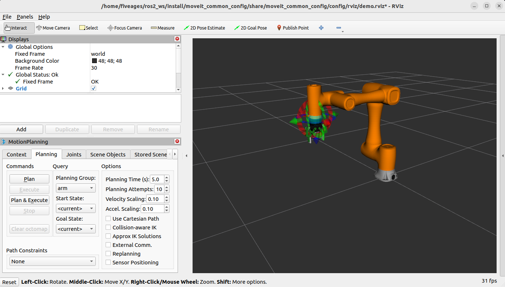
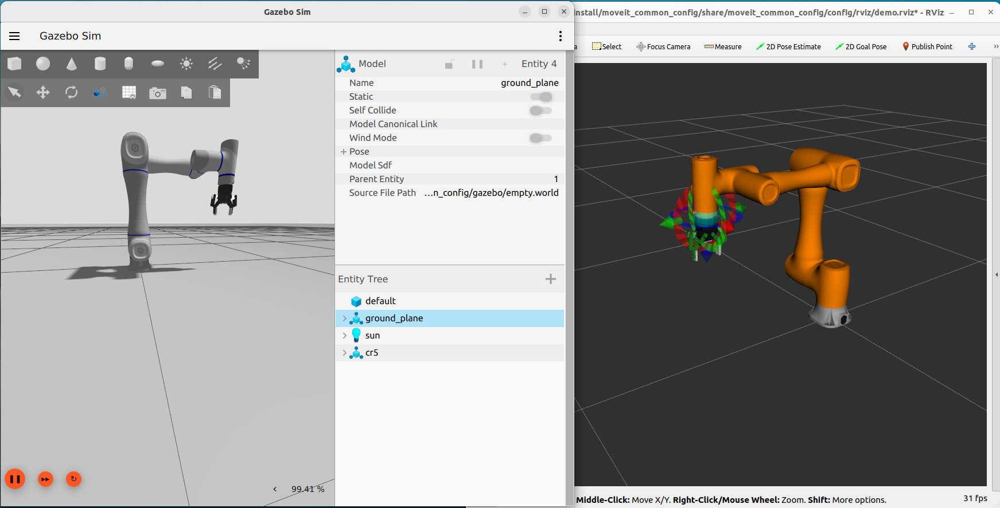

# Arm ROS2 Control

This repository contains the ros2-control files for manipulators. The robot description files are located in the [
`robot_descriptions`](https://github.com/fiveages-sim/robot_descriptions) package, please place this package with the
robot description files in the `src` directory of your ROS2 workspace, like below structure:

- ros2_ws
  - src
    - robot_descriptions
    - arm_ros2_control

## 1. Moveit2 Control

### 1.1 Moveit2 environment

Please refer to
the [Moveit2 Getting Stared](https://moveit.picknik.ai/main/doc/tutorials/getting_started/getting_started.html#install-ros-2-and-colcon)

### 1.2 Try your first launch

After you have installed the Moveit2 environment, you can tried to build the moveit_config package.

* Build Dobot CR5 Moveit2 package
    ```bash
    cd ~/ros2_ws
    colcon build --packages-up-to cr5_moveit_config --symlink-install
    ```
* Launch with mock components
    ```bash
    source ~/ros2_ws/install/setup.bash
    ros2 launch moveit_common_config demo.launch.py robot:=cr5
    ```
  

### 1.3 Moveit2 with Gazebo

To launch the Moveit2 with Gazebo, you need to install Gazebo Harmonic first.

* Install Gazebo Harmonic (ROS2 Humble)
    ```bash
    sudo apt-get install ros-humble-ros-gzharmonic
    ```
* Compile the gz_ros2_control package
    ```bash
    cd ~/ros2_ws
    colcon build --packages-up-to gz_ros2_control --symlink-install
    ```
* Launch the Moveit2 with Gazebo
    ```bash
    source ~/ros2_ws/install/setup.bash
    ros2 launch moveit_common_config demo.launch.py robot:=cr5 hardware:=gz
    ```

  

### 1.4 Using Moveit2 Servo for teleoperation
> **How to control using joystick**:
  > * `A` for switch frame between base and end-effector.
  > * `X` for trigger the gripper.

* Mock Components
  ```bash
  source ~/ros2_ws/install/setup.bash
  ros2 launch moveit_common_config servo.launch.py robot:=cr5 
  ```
* Gazebo
  ```bash
  source ~/ros2_ws/install/setup.bash
  ros2 launch moveit_common_config servo.launch.py hardware:=gz robot:=cr5 
  ```