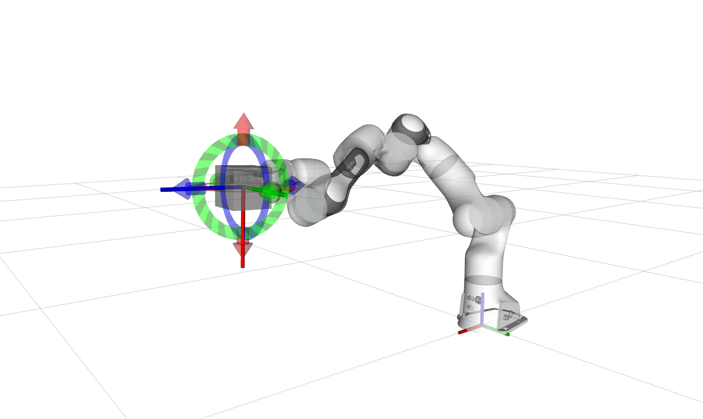

# Arms ROS2 Control

本仓库包含用于机械臂和机器人手臂的ros2-control文件。它为ROS2环境中的各种机器人机械臂提供控制器和硬件接口。

## 目录

- [项目结构](#项目结构)
- [依赖项](#依赖项)
- [支持的机器人](#支持的机器人)
- [测试环境](#测试环境)
- [快速开始](#快速开始)
- [组件](#组件)
- [配置](#配置)
- [开发](#开发)
- [故障排除](#故障排除)
- [许可证](#许可证)

## 项目结构

项目组织如下：

```
arms_ros2_control/
├── controller/                    # 控制器实现
│   ├── ocs2_arm_controller/      # 基于OCS2的机械臂控制器
│   └── adaptive_gripper_controller/ # 自适应夹爪控制器
├── hardwares/                    # 硬件接口实现
│   ├── gz_ros2_control/         # Gazebo硬件接口
│   ├── topic_based_ros2_control/ # 基于话题的硬件接口
│   └── unitree_ros2_control/    # Unitree机器人硬件接口
├── command/                      # 命令输入实现
│   ├── arms_ros2_control_msgs/  # 控制输入消息定义
│   ├── arms_rviz_control_plugin/ # RViz控制插件
│   ├── arms_target_manager/     # 目标管理系统
│   └── arms_teleop/             # 统一遥操作包
│       ├── joystick_teleop      # 基于手柄的控制
│       └── keyboard_teleop      # 基于键盘的控制
└── README.md
```

## 依赖项

本包依赖于：

- [`robot_descriptions`](https://github.com/fiveages-sim/robot_descriptions) - 机器人描述文件（URDF、XACRO）
- [`ocs2_ros2`](https://github.com/legubiao/ocs2_ros2) - OCS2 ROS2集成（`ocs2_arm_controller`需要）

**包放置位置**：`robot_descriptions`和`ocs2_ros2`都应该放在ROS2工作空间的`src`目录中，与`arms_ros2_control`并列：

```
ros2_ws/
├── src/
│   ├── robot_descriptions/        # 机器人描述文件
│   ├── ocs2_ros2/                # OCS2 ROS2集成
│   └── arms_ros2_control/        # 本包
├── install/
└── log/
```

## 支持的机器人

通过`robot_descriptions`包支持以下机器人：

- Dobot CR5
- ARX机器人
- Galaxea机器人
- LeRobot机械臂
- Airbots机器人
- Ragtime-Lab机器人

## 测试环境

本包已在以下ROS2发行版中测试并验证可用：

- **ROS2 Humble** (Ubuntu 22.04)
- **ROS2 Jazzy** (Ubuntu 24.04)


## 快速开始

<details>
<summary><strong>📥 Git克隆项目及依赖项（点击展开）</strong></summary>

要获取此项目及其依赖项，请在ROS2工作空间中克隆以下仓库：

```bash
# 导航到ROS2工作空间
cd ~/ros2_ws/src

# 克隆主项目（浅克隆 - 仅最新提交）
git clone --depth 1 git@github.com:fiveages-sim/arms_ros2_control.git

# 克隆必需的依赖项（浅克隆 - 仅最新提交）
git clone --depth 1 git@github.com:fiveages-sim/robot_descriptions.git
git clone --depth 1 git@github.com:legubiao/ocs2_ros2.git

# 使用rosdep安装依赖项
cd ~/ros2_ws
rosdep install --from-paths src --ignore-src -r -y
```

**注意**：
- `--depth 1` 标志创建浅克隆，仅下载最新提交，显著减少克隆时间和磁盘使用量
- 如果以后需要完整的git历史记录，可以使用 `git fetch --unshallow` 将浅克隆转换为完整克隆
- `rosdep install` 命令将自动安装所有必需的系统依赖项

</details>

<details>
<summary><strong>🔧 验证OCS2设置（可选）</strong></summary>

如果您是第一次接触OCS2，请先验证OCS2环境是否正确配置。通过运行移动机械臂演示之一来验证：

```bash
# 构建移动机械臂包
cd ~/ros2_ws
colcon build --packages-up-to ocs2_mobile_manipulator_ros --symlink-install --cmake-args -DCMAKE_EXPORT_COMPILE_COMMANDS=ON

# 尝试可用的演示之一：
source ~/ros2_ws/install/setup.bash

# Franka Panda
ros2 launch ocs2_mobile_manipulator_ros franka.launch.py

# 或 Mabi-Mobile
ros2 launch ocs2_mobile_manipulator_ros manipulator_mabi_mobile.launch.py
```

如果这些演示中的任何一个成功运行，则您的OCS2环境配置正确。有关更多可用演示，请参阅[ocs2_mobile_manipulator_ros README](https://github.com/legubiao/ocs2_ros2/tree/ros2/basic%20examples/ocs2_mobile_manipulator_ros)。



</details>

### 1. 构建包

```bash
cd ~/ros2_ws
colcon build --packages-up-to ocs2_arm_controller cr5_description arms_teleop adaptive_gripper_controller --symlink-install --cmake-args -DCMAKE_EXPORT_COMPILE_COMMANDS=ON
```

### 2. 使用模拟硬件启动

* 终端1：OCS2机械臂控制器
  ```bash
  source ~/ros2_ws/install/setup.bash
  ros2 launch ocs2_arm_controller demo.launch.py type:=AG2F90-C
  ```
* 终端2：遥操作节点
  ```bash
  source ~/ros2_ws/install/setup.bash
  ros2 run arms_teleop keyboard_teleop
  ```

> **交互式控制：**
> - 在终端中按数字键切换FSM状态（例如，按3进入OCS2状态，按2进入HOLD状态，按1进入HOME状态）
> - 在RViz中，拖拽交互式标记设置目标位置，然后右键单击发送轨迹命令
>
> 

### 3. 使用Gazebo仿真启动

#### 对于ROS2 Humble：
* 安装Gazebo Harmonic
    ```bash
    sudo apt-get install ros-humble-ros-gzharmonic
    ```
* 编译增强的gz_ros2_control包
    ```bash
    cd ~/ros2_ws
    colcon build --packages-up-to gz_ros2_control --symlink-install --cmake-args -DCMAKE_EXPORT_COMPILE_COMMANDS=ON
    ```

#### 对于ROS2 Jazzy：
* 安装Gazebo Harmonic
    ```bash
    sudo apt-get install ros-jazzy-gz-ros2-control
    ```

#### 启动控制器（适用于两个发行版）：
这里使用了智元精灵G1机器人作为例子
* 编译机器人模型包
  ```bash
  cd ~/ros2_ws
  colcon build --packages-up-to agibot_g1_description --symlink-install --cmake-args -DCMAKE_EXPORT_COMPILE_COMMANDS=ON
  ```
* 你可以使用`world`参数来切换gazebo加载的环境模型
  ```bash
  source ~/ros2_ws/install/setup.bash
  ros2 launch ocs2_arm_controller demo.launch.py robot:=agibot_g1 hardware:=gz world:=warehouse
  ```
  

### 4. 使用Isaac Sim仿真启动

* 编译增强的topic_based_ros2_control包
  ```bash
  cd ~/ros2_ws
  colcon build --packages-up-to topic_based_ros2_control --symlink-install --cmake-args -DCMAKE_EXPORT_COMPILE_COMMANDS=ON
  ```
* 启动控制器（在此步骤之前启动Isaac Sim）
  ```bash
  source ~/ros2_ws/install/setup.bash
  ros2 launch ocs2_arm_controller demo.launch.py hardware:=isaac type:=AG2F90-C
  ```
  

## 组件

### 控制器

#### OCS2机械臂控制器

`ocs2_arm_controller`使用OCS2框架为机械臂提供基于MPC的控制。

**特性：**

- 用于轨迹跟踪的模型预测控制（MPC）
- 实时优化
- 支持各种机器人配置

#### 自适应夹爪控制器

`adaptive_gripper_controller`提供基础夹爪控制功能，具有位置读取和输出能力。

**特性：**

- 从硬件接口读取位置信息
- 向硬件接口输出位置命令
- 基础夹爪位置控制
- 易于理解和扩展

### 硬件接口

#### Gazebo硬件接口

`gz_ros2_control`包为Gazebo仿真提供硬件接口。原始版本可在[gz ros2 control](https://github.com/ros-controls/gz_ros2_control)找到。

**特性：**

- 实时仿真集成
- 支持各种Gazebo插件
- 可配置的世界文件

#### 基于话题的硬件接口

`topic_based_ros2_control`包提供通过ROS2话题通信的通用硬件接口。原始版本可在[topic based ros2 control](https://github.com/PickNikRobotics/topic_based_ros2_control)找到。

**特性：**

- 适用于任何硬件的通用接口
- 基于话题的通信
- 易于与自定义硬件集成

#### Unitree硬件接口

`unitree_ros2_control`包基于unitree_sdk2为Unitree机器人提供硬件接口。

**特性：**

- 支持Unitree G1和其他sdk2兼容机器人
- Mujoco仿真集成
- 真实机器人支持

### 命令输入系统

#### Arms RViz控制插件

`arms_rviz_control_plugin`提供智能RViz插件，结合了OCS2机械臂控制器和自适应夹爪控制器的控制功能。

**特性：**

- **OCS2机械臂控制器控制：**
  - 智能FSM状态显示和切换
  - 动态按钮控制，只显示可用的状态转换
  - 遵循OCS2机械臂控制器FSM规则的正确状态转换
  - HOLD初始状态和正确的状态流程
  - HOME状态下的姿态切换功能
- **夹爪控制器控制：**
  - 左右夹爪控制按钮
  - 实时夹爪状态显示
  - 单臂/双臂夹爪支持
  - 自动控制器检测和UI适配

#### Arms目标管理器

`arms_target_manager`为设置机械臂末端执行器目标姿态提供3D交互式标记。

**特性：**

- RViz中的3D交互式标记
- 单臂/双臂支持
- VR遥操作
- 手柄遥操作

#### Arms遥操作

`arms_teleop`包为机械臂提供统一的遥操作功能。

**特性：**

- 基于手柄的控制
- 基于键盘的控制
- 不同输入方法的统一接口

## 配置

### 机器人配置

机器人特定配置存储在`robot_descriptions`包中。每个机器人都有自己的描述包，包含：

- URDF/XACRO文件
- 配置文件
- 网格文件

### 控制器配置

控制器配置存储在相应的控制器包中：

- `ocs2_arm_controller/config/` - OCS2控制器配置
- 硬件特定配置在硬件接口包中

## 开发

### 添加新机器人

1. 将机器人描述添加到`robot_descriptions/manipulator/`
2. 在相应的控制器包中创建配置文件
3. 更新启动文件以包含新机器人
4. 在转移到真实机器人之前，使用模拟和仿真器硬件进行测试

### 添加新控制器

1. 在`controller/`目录中创建新包
2. 实现控制器接口
3. 添加配置和启动文件
4. 使用使用说明更新此README

## 故障排除

### 常见问题

1. **构建错误**：确保所有依赖项都已安装和构建
2. **启动错误**：检查机器人描述是否正确安装
3. **硬件连接**：验证硬件接口配置

### 获取帮助

- 查看各个包的README文件以获取具体说明
- 查看`ocs2_ros2`文档以了解OCS2特定问题
- 查看`robot_descriptions`包以了解机器人特定配置

## 许可证

本包根据Apache License 2.0许可。详情请参阅[LICENSE](LICENSE)文件。 
