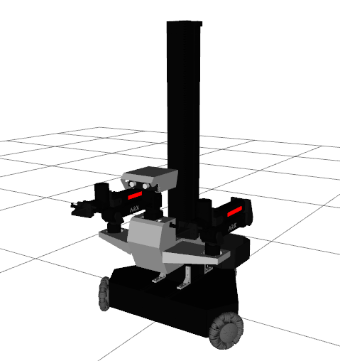

# ARX Lift Description

## 1. Build
```bash
cd ~/ros2_ws
colcon build --packages-up-to lift_description --symlink-install
```

## 2. Visualize the robot

To visualize and check the configuration of the robot in rviz, simply launch:

```bash
source ~/ros2_ws/install/setup.bash
ros2 launch lift_description visualize.launch.py
```



## 3. OCS2 Demo
```bash
source ~/ros2_ws/install/setup.bash
ros2 launch lift_description ocs2.launch.py
```