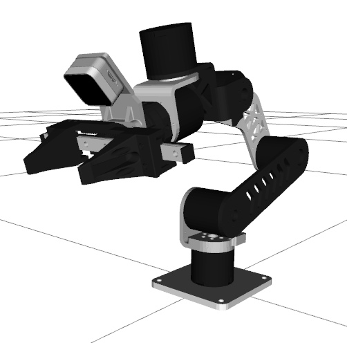

# Panthera Description

Origin Project: [Panthera](https://github.com/Ragtime-LAB/Ragtime_Panthera)

The model of camera support is from ARX Robotics.

## 1. Build
```bash
cd ~/ros2_ws
colcon build --packages-up-to panthera_description --symlink-install
```

## 2. Visualize the robot

To visualize and check the configuration of the robot in rviz, simply launch:

* Launch Arm
```bash
source ~/ros2_ws/install/setup.bash
ros2 launch panthera_description visualize.launch.py
```
