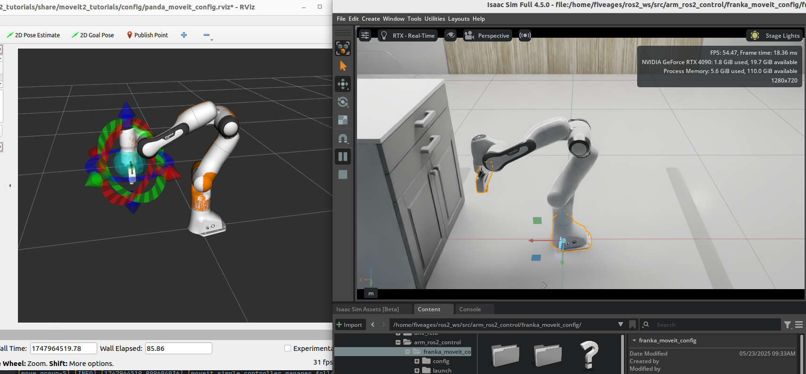

# Franka Isaac Sim Moveit2
Moveit2 can control the franka robot in Isaac Sim by using [Topic Based ROS2 Control](https://github.com/PickNikRobotics/topic_based_ros2_control). 

## 1. Build
```bash
cd ~/ros2_ws
colcon build --packages-up-to franka_moveit_config --symlink-install
```

## 2. Launch
* Launch Isaac Sim Simulation before launch Moveit, otherwise there may have unknown issue.

### 2.1 Launch Moveit2
* Mock Components
```bash
source ~/ros2_ws/install/setup.bash
ros2 launch franka_moveit_config isaac_demo.launch.py ros2_control_hardware_type:=mock_components
```
* Isaac SIM
```bash
source ~/ros2_ws/install/setup.bash
ros2 launch franka_moveit_config isaac_demo.launch.py
```


### 2.2 Launch Moveit2 Servo
* Mock Components
```bash
source ~/ros2_ws/install/setup.bash
ros2 launch franka_moveit_config servo_example.launch.py ros2_control_hardware_type:=mock_components
```
* Isaac SIM
```bash
source ~/ros2_ws/install/setup.bash
ros2 launch franka_moveit_config servo_example.launch.py
```